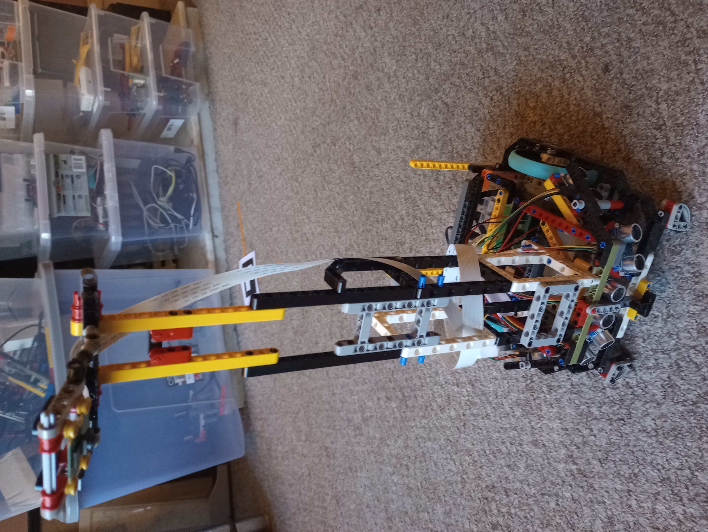
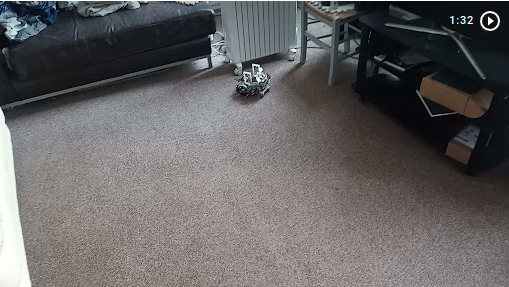
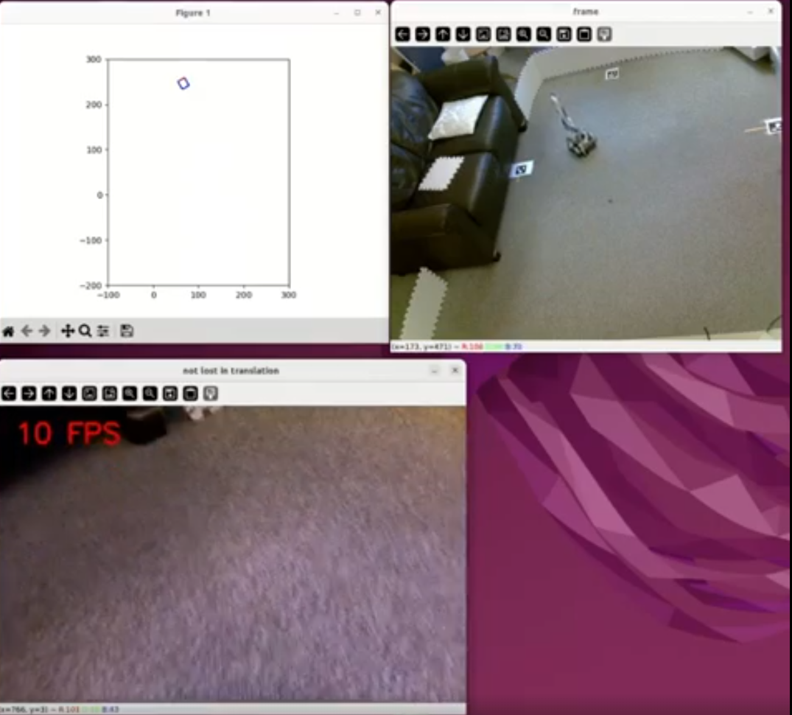

# Raspberry Pi robot

## Introduction
This is the main software repository for the pictured robot.  Much of the codebase that this robot uses has been split out into reusable packages that can be used in other projects.  This codebase composes these packages and adds to them to give the robot complex higher-level behaviours.

If you just want to see the robot in action there are some videos at the [bottom of the page](#id1) 

## A note to anyone that wants to build this robot
I am still in the phase of making a lot of changes to this project once I have completed the next behaviour I will move into a phase where I document things more clearly and organise the code to be more understandable.

## Implemented So Far

- can drive around in unstructured messy human environments with very robust obstacle avoidance.  there is a video bellow.
- track its location using odometry via wheel encoders.
- Update the absolute location of the robot intermittently.  Use computer vision to estimate pose of the robot using a calibrated camera and aruco markers of known location. there is a video bellow.
- Display the location of the robot on a remote machine.
- Show the robots eye view on a remote machine.
- Use a distributed software architecture multiple processes across multiple machines that interact via tcp using a custom library I wrote called robonet.
- Compose behaviours using the subsumption control architecture

## Coming soon

Perform a collection task – there will be multiple lego wheels spread about the robots environment.  The robot will use computer vision to identify the wheels It will collect them and return them all to the same location.
All the features that have came so far have been building up to giving the robot the ability to do this.

## Hardware

### Raspberry Pi Build hat
Although this project uses Lego motors, the speed control of the motors is done from scratch by reading the encoders to measure speed, running a pid algorithm and setting the power of the motors via pwm.
This was actually more difficult than just using a standard dc motor with and encoder, as i had to communicate with obscure firmware on the build hat via serial to read encoders and set power.  however i wanted to use lego because of the mechanical flexibility it brings, and now that i have figured this out it can be used in multiple projects.

The reason for doing it like this was that the official library for the build hat has some shortcomings that make it not fit for purpose for robotics. I have published a custom library that can be used in any project, https://github.com/gregorianrants/buildhat-alternative

### Rest of hardware

- Raspberry pi
- Pi camera
- 5 * HC-SR04 ultrasonic distance sensors (3v version)
- 5 * lithium AA battery  and a 5 battery holder
- Lots of lego technic
- Lego Large Angular Motor 88017

## Associated libraries

This library composes other robotics libraries i wrote.
it is important to note that a lot of the behaviors rely on the composed robot desktop package running on another machine. the other 2 packages are dependencies of this codebase.

### composed-robot-desktop

communicates with robot via robonet. will be used for viewing output of camera, and intensive data processing and other things best done of pi. so far i am using for outputting a plot of encoder readings.

https://github.com/gregorianrants/composed-robot-desktop

### Buildhat-alternative

an alternative library to the official library for the build hat, that overcomes some of its issues with speed control. i use this for speed control of motors. This is the main library for controlling the library and there is more info about it in the readme.

https://github.com/gregorianrants/buildhat-alternative

### Robonet

a library for communication between nodes on robot and across lan using zeromq

https://github.com/gregorianrants/robonet

## entry points

vs code tasks is used to launch the entry points you can see the tasks in the file .vscode/tasks.json
i will be adding more info to the repo about launching behaviors once the next behavior is complete.

## Software Architecture

Multiple Nodes running on separate processes both on robot and off robot across the network

Publisher Nodes register their node_name and topic with a manager node.

Subscriber nodes that are interested in listening to a topic and/or node_name get the address that the topic/nodes are publishing on from the manager node. The nodes then communicate directly with each other in peer to peer fashion using events.

I previously used this system to communicate between nodes written in different languages. I now only use python.

Nodes can be composed in diverse ways to create behaviors. vs code tasks are used to launch suites of nodes and run behaviors.

## Obstacle avoidance 

here is a video of the robot doing obstacle avoidance

https://youtu.be/hJ4X7Qsf1MY

<!---  --->

## Location Tracking

